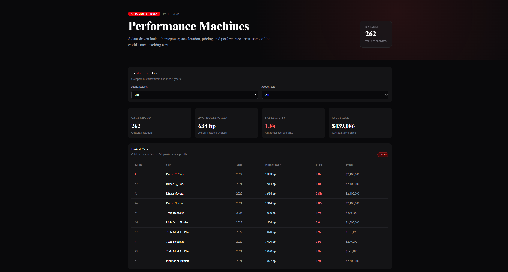
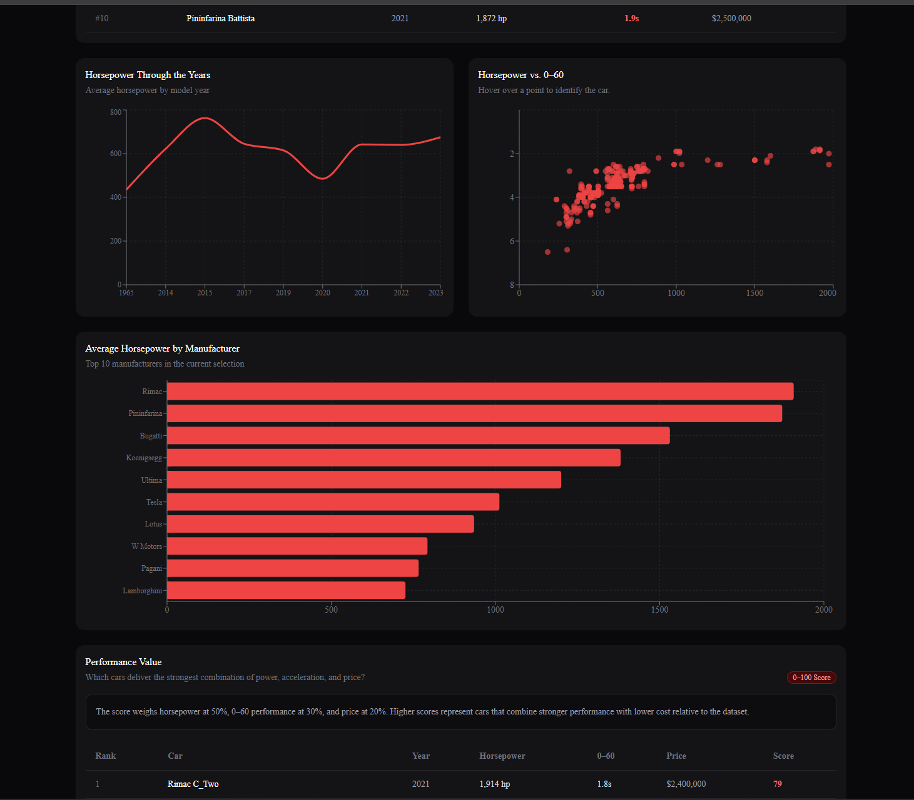
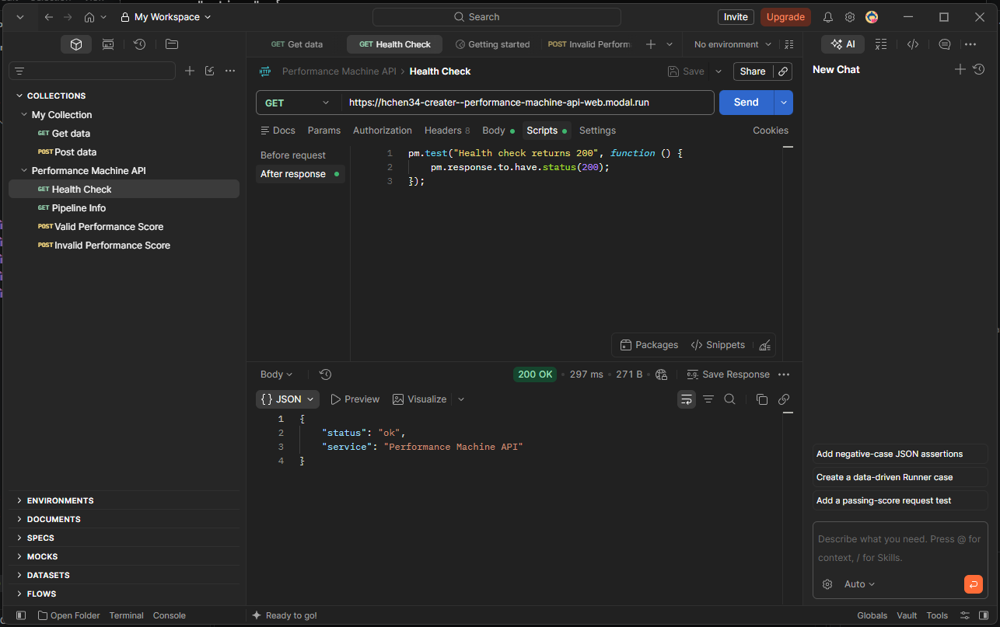
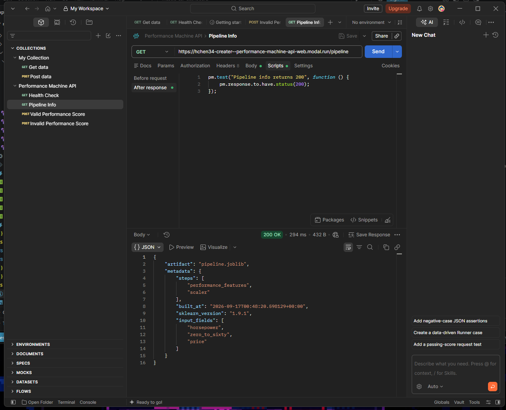
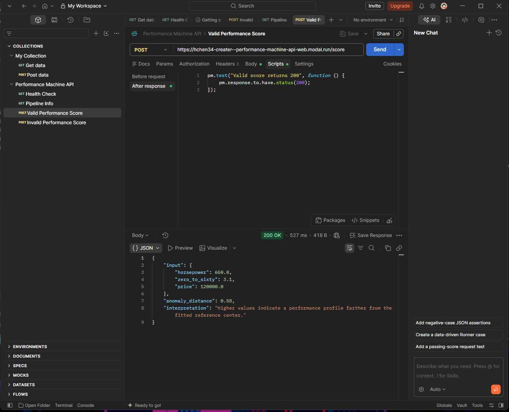
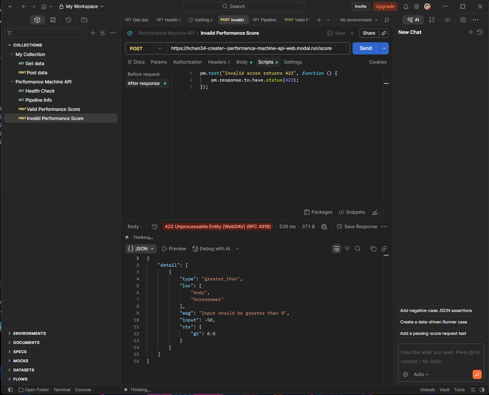

# Performance Machines

Performance Machines is an interactive automotive performance analytics dashboard built for DTSC 3601. The project explores horsepower, acceleration, pricing, and manufacturer trends across a dataset of high-performance cars from 1965 to 2023.

The dashboard was built with Next.js, TypeScript, Tailwind CSS, shadcn/ui, Recharts, Supabase, GitHub, and Vercel.

## Project Features

- Interactive manufacturer filter
- Interactive model year filter
- Summary statistics for:
  - Cars shown
  - Average horsepower
  - Fastest 0-60 time
  - Average price
- Top 10 fastest cars ranking
- Horsepower through the years line chart
- Horsepower vs 0-60 scatter plot
- Average horsepower by manufacturer bar chart
- Performance Value ranking
- Clickable car rows that open a detailed performance profile
- Live data loaded from Supabase

## Dataset

The project uses the Sports Car Prices dataset from Kaggle.

The original dataset contained 1,007 records. After cleaning the data and resolving duplicate make, model, and year combinations, the final Supabase table contains 262 unique vehicles.

The main variables used in the dashboard include:

- Car Make
- Car Model
- Year
- Engine Size
- Horsepower
- Torque
- 0-60 MPH Time
- Price

Some electric and hybrid vehicles do not have a traditional engine displacement value, so those records may display `N/A` for engine size.

## Dashboard Overview



## Interactive Visualizations


## Technology Used

- Next.js
- TypeScript
- Tailwind CSS
- shadcn/ui
- Recharts
- Supabase
- GitHub
- Vercel

## Data Cleaning

The original dataset contained several formatting issues, including values such as:

- `1000+`
- `1,000+`
- `Electric`
- `Hybrid`
- `N/A`
- Prices containing commas

The dataset was cleaned before being loaded into Supabase. Numeric values were standardized where possible, invalid numeric values were converted to null, and duplicate vehicles were resolved by keeping one record for each make, model, and year combination.

For duplicate make/model/year records, the vehicle with the fastest recorded 0-60 time was retained.

## Supabase

The cleaned data is stored in a Supabase table named:

`cars_final`

The dashboard connects to Supabase and loads the vehicle data directly into the application.

## Running the Project Locally

Install the project dependencies:

```bash
npm install
## Screenshots

### Dashboard Overview

The main dashboard provides interactive filters, summary statistics, vehicle rankings, and performance information loaded from Supabase.


### Interactive Data Visualizations

The dashboard includes interactive charts for horsepower trends, acceleration performance, and manufacturer comparisons.



## Modal API Testing

The performance analysis API was deployed using Modal and tested using Postman.

### API Health Check

The deployed API responds successfully with a 200 OK status.



### Pipeline Endpoint

The pipeline endpoint confirms that the performance analysis pipeline and model artifacts are available.



### Performance Score Endpoint

A POST request sends horsepower, 0-60 time, and price to the deployed API. The API returns an anomaly distance based on the fitted performance-car reference data.



### Invalid Input Validation

Invalid input is rejected by the API with a `422 Unprocessable Entity` response, confirming that the Pydantic validation bounds are working.



## Pipeline Model

I chose an anomaly-distance model because I wanted to compare a car's performance to the other performance cars in the data rather than predict a specific label. The pipeline uses horsepower, 0-60 time, and price to calculate how far a car is from the fitted reference data. I also created a custom transformer called `PerformanceFeatureTransformer` that creates additional performance features before the data is scaled. The pipeline was built using scikit-learn version `1.9.1`.